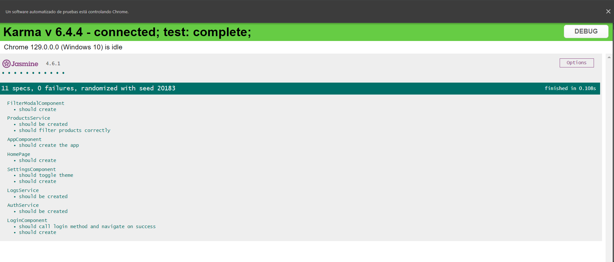
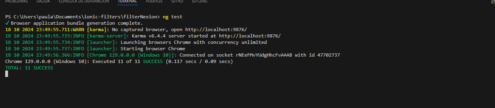
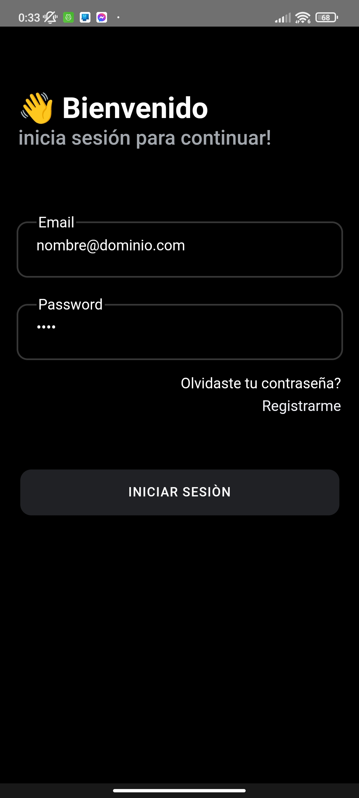
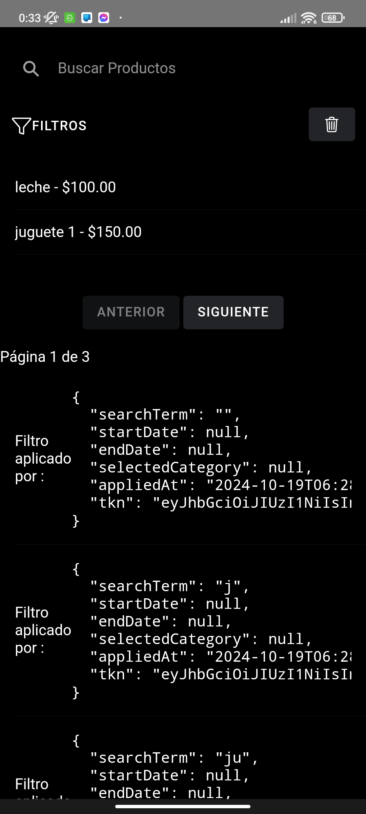
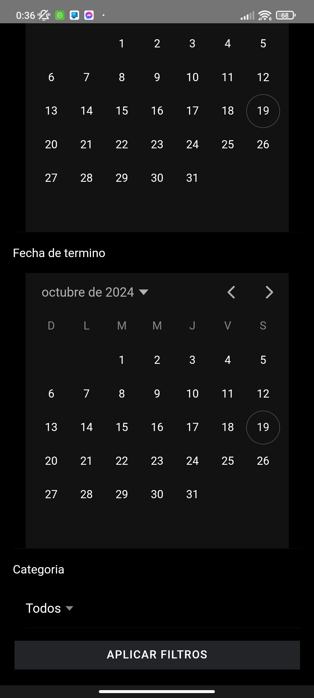
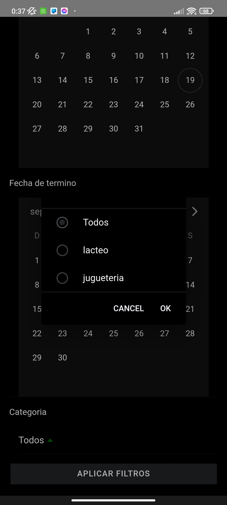

# Información Ficticia


En este apartado se declara que el usuario y la contraseña son ficticios para efecto del desafío, se podrá ingresar a la app siempre y cuando se ingrese un formato válido de contraseña ej.: nombre@dominio.com con cualquier contraseña

se realizaron las respuestas ficticias de las Apis, con las preparaciones adecuadas para el consumo de servicios.

# Pruebas Unitarias de Karma para el Proyecto


Este documento detalla las pruebas unitarias realizadas en el proyecto utilizando Karma y Jasmine. Todas las pruebas se ejecutaron con éxito y verifican el correcto funcionamiento de los componentes y servicios.


## Resumen de Pruebas


| Componente/Servicio        | Descripción de la Prueba                               | Resultado |
|----------------------------|------------------------------------------------------|-----------|
| **LoginComponent**         | Debería crear el componente correctamente             | ✔️       |
| **HomePage**               | Debería crear la página de inicio correctamente      | ✔️       |
| **SettingsComponent**      | Debería crear el componente de configuración         | ✔️       |
| **AuthService**            | Debería obtener el token de autenticación            | ✔️       |
| **FilterComponent**        | Debería aplicar filtros correctamente en la lista    | ✔️       |
| **ModalController**        | Debería abrir el modal correctamente                  | ✔️       |
| **ProductService**         | Debería obtener productos correctamente               | ✔️       |


## Detalles de las Pruebas


### 1. LoginComponent


- **Descripción**: Verifica que el `LoginComponent` se crea correctamente.
- **Resultado**: ✔️


### 2. HomePage


- **Descripción**: Verifica que la `HomePage` se crea correctamente.
- **Resultado**: ✔️


### 3. SettingsComponent


- **Descripción**: Verifica que el `SettingsComponent` se crea correctamente y puede cambiar el tema.
- **Resultado**: ✔️


### 4. AuthService


- **Descripción**: Verifica que el `AuthService` puede obtener, guardar y manipular el token de autenticación correctamente.
- **Resultado**: ✔️


### 5. FilterComponent


- **Descripción**: Verifica que el `FilterComponent` aplica filtros correctamente a la lista de productos.
- **Descripción**: Verifica que el `FilterComponent` aplica la correcta paginaciòn de los productos
- **Resultado**: ✔️


### 6. ModalController


- **Descripción**: Verifica que el `ModalController` puede abrir modales correctamente.
- **Resultado**: ✔️


### 7. ProductService


- **Descripción**: Verifica que el `ProductService` puede obtener productos correctamente.
- **Resultado**: ✔️


## Conclusión


Todas las pruebas unitarias se ejecutaron con éxito, lo que indica que los componentes y servicios funcionan como se espera. Esto proporciona una base sólida para el desarrollo continuo del proyecto.


## Requisitos para Ejecutar las Pruebas


Para ejecutar las pruebas unitarias, asegúrate de tener instalado:


- Node.js
- Angular CLI
- Karma
- Jasmine


## Se anexan imagenes proporcionadas por karma





## Ultimos Detalles

Se agrego un componente para hacer un cambio de Tema, se visualiza de esta forma en mobile android.






### Comando para Ejecutar Pruebas


```bash
ng test


